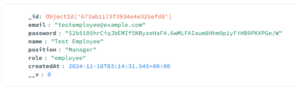
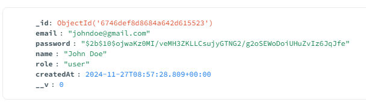
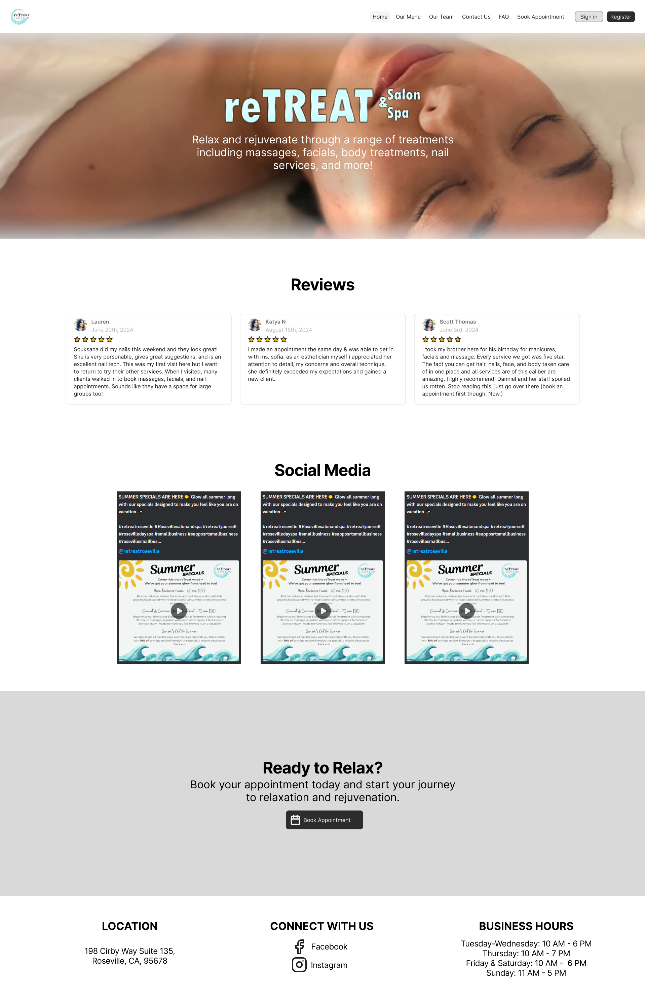
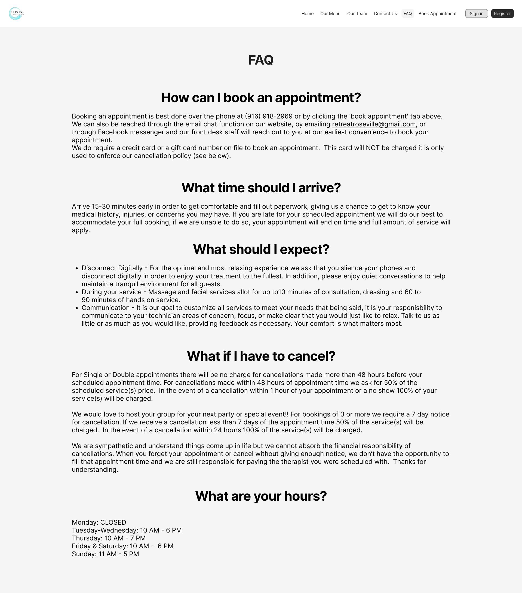
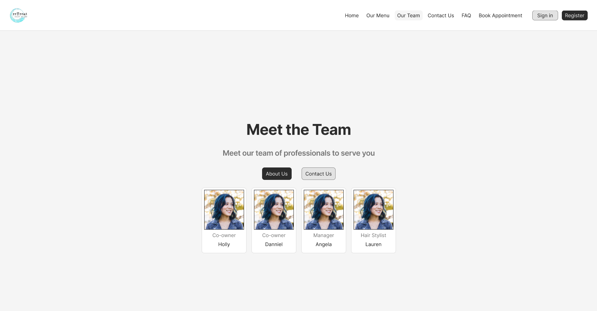
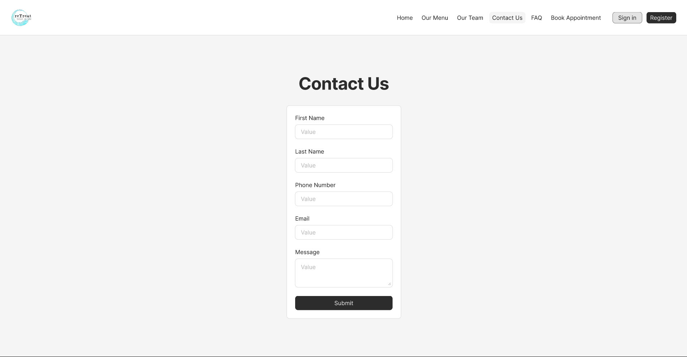
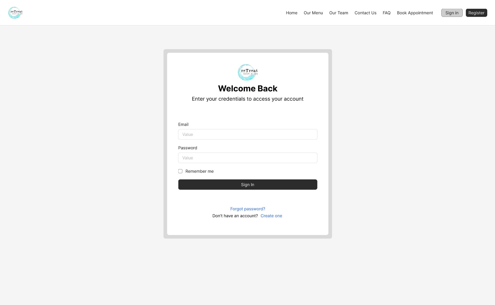
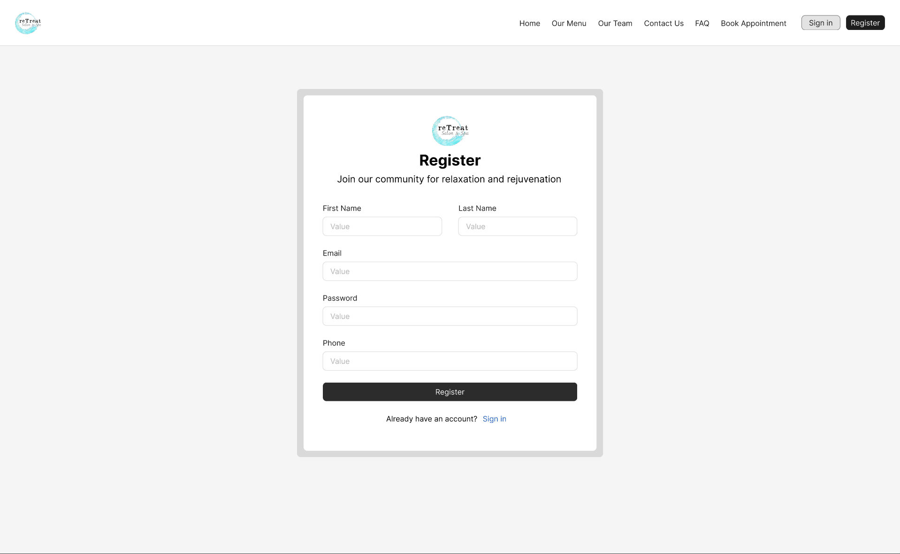
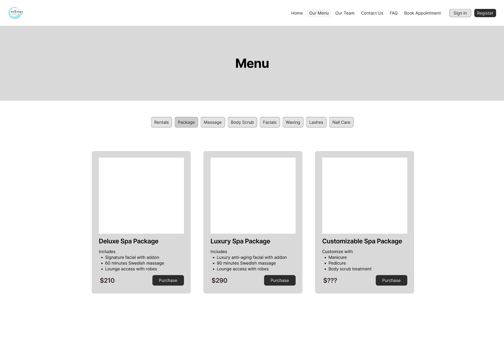
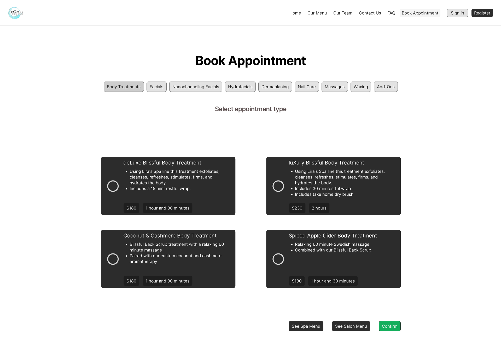

# reTreat

<div align="center">
    

reTreat is a full service Salon & Spa offering massages, facials, body treatments, natural nail services, waxing, teeth whitening, reiki, and salon services. You are going to feel right at home in our comfortable space and our amazing team will treat or reTreat you from your everyday life stresses! Our trained and experienced therapists will work with you to customize services to meet your specific needs, ensuring that you receive the utmost care and attention during your time with us. For the perfect cherry on top, don't forget to visit our reLaxation Lounge during your stay!
</div>

## The Fellas

<table align="center">
  <tr>
    <th>Team Member</th>
    <th>Email</th>
  </tr>
  <tr>
    <td>Samuel Caus</td>
    <td>scaus@csus.edu</td>
  </tr>
  <tr>
    <td>Tristan Dinh</td>
    <td>tristandinh@csus.edu</td>
  </tr>
  <tr>
    <td>Puth Vang</td>
    <td>puthvang@csus.edu</td>
  </tr>
  <tr>
    <td>Kyle Nguyen</td>
    <td>kyletnguyen@csus.edu</td>
  </tr>
  <tr>
    <td>Jordan Penaloza</td>
    <td>jordanpenaloza@csus.edu</td>
  </tr>
  <tr>
    <td>Anthony Barajas</td>
    <td>anthonybarajas2@csus.edu</td>
  </tr>
  <tr>
    <td>Anna Tran</td>
    <td>annahtran@csus.edu</td>
  </tr>
  <tr>
    <td>Wenshen Zhong</td>
    <td>wenshenzhong@csus.edu</td>
  </tr>
</table>

## Tech Stack
**Frontend**
- [React](https://reactjs.org): React is a JavaScript library used for building user interfaces. It allows developers to create reusable UI components and manage the state of those components in a clear and efficient manner.
- [ViteJS](https://vitejs.dev/): Vite is a fast build tool and development server that significantly improves the development experience. It supports fast hot module replacement (HMR), meaning updates to your code reflect instantly in the browser without needing to reload the whole page.
- [MaterialUI](https://mui.com/material-ui/): Material UI is a popular React component library that implements Google’s Material Design guidelines. It provides pre-built components like buttons, forms, modals, and more, along with styling solutions, to help speed up UI development.

**Backend:**
- [Node.js](https://nodejs.org/en): A runtime environment that allows you to run JavaScript on the server side. Node.js is built on Chrome's V8 JavaScript engine, which makes it fast and efficient. It's commonly used for building scalable and performant web applications, APIs, and real-time applications. It has a large ecosystem of libraries via npm (Node Package Manager).

**APIs**
- Google Maps API: Used for embedding maps, geolocation, and places-related features such as grabbing reviews in our application.
- SquareAPI: A powerful API suite for handling payments, inventory, and customer management.
- Instagram Post API: Used for embedding social media feeds or analyzing engagement metrics in our application.

**ERD**
- We use MongoDB which does not necessarily require an ERD. However, the images below are the current schemas of our MongoDB. There are more to come.

### Employee Schema


### User Schema


## Prototype Images
- These are the prototype images of the website. The live images will arrive below these prototype images when we are done.

### **Main Page**


### **FAQ Page**


### **Team Page**


### **Contact Page**


### **Login Page**


### **Register Page**


### **Menu Page**


### **Appointment Page**


## Testing
To be updated

## Deployment
To be updated

## Developer instructions
**Clone repository**
```bash
git clone https://github.com/The-Fella-s/reTreat.git
```

Go to the project directory
```bash
cd reTreat
```

Go to the frontend and backend directory, each with their own terminal
```bash
cd frontend
cd backend
```

With **[npm](https://www.npmjs.com/)** installed, install the dependencies and run the servers in the two directories
```bash
npm install
npm run dev
```

# Timeline
| Sprint | Task                                                                     | Status  | Start Date | End Date   |
|--------|--------------------------------------------------------------------------|---------|------------|------------|
| 1      | Work on prototype and research APIs that are needed                      | Done    | 09/23/2024 | 10/06/2024 |
| 2      | Start working on the frontend                                            | Done    | 10/07/2024 | 10/20/2024 |
| 3      | Refine the UI and finish the other pages                                 | Done    | 10/21/2024 | 11/10/2024 |
| 4      | Finish most of the frontend, start working on the dashboard and backend  | Done    | 11/11/2024 | 11/24/2024 |
| 5      | Implement in client changes, start working on backend, implement in APIs | Pending | 01/22/2025 | 02/11/2025 |
| 6      | Implement more of the backend alongside the testing APIs                 | Pending | 02/12/2025 | 02/25/2025 |
| 7      | Track appointments, schedules, and allow things to be added to database  | Pending | 02/26/2025 | 03/11/2025 |
| 8      | Refine the frontend UI and backend                                       | Pending | 03/12/2025 | 03/25/2025 |
| 9      | Refine more of the frontend UI and do more testing, fix bugs             | Pending | 03/26/2025 | 04/15/2025 |
| 10     | Finish testing frontend and backend, complete finishing touches          | Pending | 04/16/2025 | 04/29/2025 |
