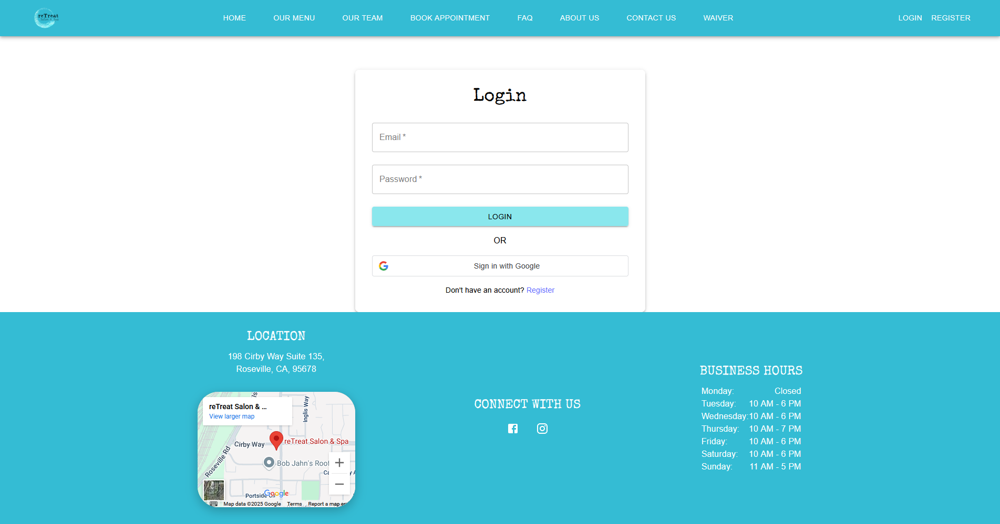

# reTreat

<div align="center">
    

reTreat is a full service Salon & Spa offering massages, facials, body treatments, natural nail services, waxing, teeth whitening, reiki, and salon services. You are going to feel right at home in our comfortable space and our amazing team will treat or reTreat you from your everyday life stresses! Our trained and experienced therapists will work with you to customize services to meet your specific needs, ensuring that you receive the utmost care and attention during your time with us. For the perfect cherry on top, don't forget to visit our reLaxation Lounge during your stay!
</div>

## 📌 Our Project

**reTreat** is more than a spa — it's a modern redesign of their current website hosted on Wix that allows them to handle multiple things under one application.

### 💻 Tech Stack

- **Frontend**: React, Vite, Material UI
- **Backend**: Node.js, Express.js
- **Database**: MongoDB (hosted on Atlas)
- **Authentication**: Google OAuth & JWT
- **Hosting**: AWS Amplify (frontend & Lambda backend)
- **Media and Promotion Integration**: Instagram Graph API
- **Email Service**: SendGrid
- **Storage**: AWS S3 for image uploads

### 🔧 Key Features

- 🌐 **Responsive Design** — Mobile-friendly booking and service browsing
- 🔐 **Secure Login** — Google login and role-based access control
- 🗓 **Admin Dashboard** — Staff, theme, and post management tools
- 📷 **Instagram Feed Sync** — Auto-fetch & display recent posts
- ☁️ **Image Uploads** — S3-hosted team and gallery images

## The Fellas

<table align="center">
  <tr>
    <th>Team Member</th>
    <th>Email</th>
  </tr>
  <tr>
    <td>Samuel Caus</td>
    <td>scaus@csus.edu</td>
  </tr>
  <tr>
    <td>Tristan Dinh</td>
    <td>tristandinh@csus.edu</td>
  </tr>
  <tr>
    <td>Puth Vang</td>
    <td>puthvang@csus.edu</td>
  </tr>
  <tr>
    <td>Kyle Nguyen</td>
    <td>kyletnguyen@csus.edu</td>
  </tr>
  <tr>
    <td>Jordan Penaloza</td>
    <td>jordanpenaloza@csus.edu</td>
  </tr>
  <tr>
    <td>Anthony Barajas</td>
    <td>anthonybarajas2@csus.edu</td>
  </tr>
  <tr>
    <td>Anna Tran</td>
    <td>annahtran@csus.edu</td>
  </tr>
  <tr>
    <td>Wenshen Zhong</td>
    <td>wenshenzhong@csus.edu</td>
  </tr>
</table>

## Live

### **Main Page**


### **Menu Page**


### **Team Page**


### **Appointment Page**


### **FAQ Page**


### **About Us Page**


### **Contact Us Page**


### **Waiver Page**


### **Login Page**


### **Register Page**


### **Dashboard Page**


### **Dashboard Employee Page**


### **Dashboard Users Page**


### **Dashboard Booking Page**


### **Dashboard Themes Page**


## Tech Stack
**Frontend**
- [React](https://reactjs.org): React is a JavaScript library used for building user interfaces. It allows developers to create reusable UI components and manage the state of those components in a clear and efficient manner.
- [ViteJS](https://vitejs.dev/): Vite is a fast build tool and development server that significantly improves the development experience. It supports fast hot module replacement (HMR), meaning updates to your code reflect instantly in the browser without needing to reload the whole page.
- [MaterialUI](https://mui.com/material-ui/): Material UI is a popular React component library that implements Google’s Material Design guidelines. It provides pre-built components like buttons, forms, modals, and more, along with styling solutions, to help speed up UI development.

**Backend:**
- [Node.js](https://nodejs.org/en): A runtime environment that allows you to run JavaScript on the server side. Node.js is built on Chrome's V8 JavaScript engine, which makes it fast and efficient. It's commonly used for building scalable and performant web applications, APIs, and real-time applications. It has a large ecosystem of libraries via npm (Node Package Manager).

**APIs**
- Google Maps API: Used for embedding maps, geolocation, and places-related features such as grabbing reviews in our application.
- SquareAPI: A powerful API suite for handling payments, inventory, and customer management.
- Instagram Post API: Used for embedding social media feeds or analyzing engagement metrics in our application.

**ERD**
- We use MongoDB which does not necessarily require an ERD. However, the images below are the current schemas of our MongoDB. There are more to come.

### Employee Schema


### User Schema


## Testing
1. **Clone repository**
```bash
git clone https://github.com/The-Fella-s/reTreat.git
```

2. **Select where you want to test, frontend or backend**
```bash
cd frontend
```
```bash
cd backend
```

3. **Install dependencies**
```bash
npm install
```

4. **Run all tests**
```bash
npm run test
```

5. **Run individual test with %filename%.test.js**
```bash
npm run test %filename%.test.js
```
i.e. Frontend main page
```bash
cd frontend
npm run test Main.test.jsx
```
i.e. Backend Instagram routes
```bash
cd backend
npm run test instagramRoutes.test.jsx
```

## Frontend Deployment
1. **Open Your Amplify App**
   - Go to `https://us-west-1.console.aws.amazon.com/amplify/apps`
   - Click on your Amplify app instance.

2. **Add (or Configure) a Frontend Branch**
   1. In the side menu, select **Branches**
   2. Under **Deploy frontend**, click **Get started**

3. **Connect Your GitHub Repository**
   - Choose **GitHub** as the repository provider
   - Click **Next**, authorize Amplify if prompted
   - Select:
      - **Repository**: `reTreat`
      - **Branch**: `main`
   - Click **Next**

4. **Edit Your Build Settings (`amplify.yml`)**
   1. Click **Edit YML file**
   2. Replace the contents with:
      ```yaml
      version: 1
      frontend:
        runtime-versions:
          nodejs: 20
        phases:
          preBuild:
            commands:
              - cd frontend
              - rm -rf node_modules package-lock.json
              - npm install
          build:
            commands:
              - npm run build
        artifacts:
          baseDirectory: frontend/dist
          files:
            - '**/*'
        cache:
          paths: []
      ```
   3. Click **Save**

5. **Link Your Backend Environment & IAM Role**
   - Scroll to **Select a backend environment to use with this branch** and choose your Amplify environment (e.g., `dev`)
   - Under **Service role**, select the IAM role you created (e.g., `retreatexampleLambdaRole48832019-dev`)

6. **Set Environment Variables**
   1. Expand **Advanced settings**
   2. Under **Environment variables**, add the following keys (with their values):

      ```env
      VITE_API_URL=
      VITE_GOOGLE_CLIENT_ID=
      VITE_GOOGLE_MAP_API=
      ```

   4. Click **Next**

7. **Review & Deploy**
   - On the **Review** screen, confirm all settings
   - Click **Save and deploy**

8. **Monitor Deployment**
   - You’ll see your branch kick off a deployment
   - Click on the branch to view real-time build logs
   - Wait for all build phases (preBuild → build → deploy) to complete

9. **Verify Your Live Site**
   - Once deployed, Amplify will provide a URL (e.g. `https://<branch>.<your-app>.amplifyapp.com`)
   - Open it in your browser to confirm your `reTreat` frontend is live

> **Tip:** Any future pushes to your GitHub `main` branch will automatically trigger this same build & deploy pipeline.


## Backend API deployment
1. **Initialize the API**
   ```bash
   amplify add api
   ```  
   - Select **REST** (it defaults to GraphQL).
   - Name it `reTreatExampleAPI`.
   - Set the path to `/api` (e.g. `https://<api-id>.execute-api.us-west-1.amazonaws.com/dev/api/`).

2. **Configure the Lambda backend**
   - Enter Lambda function name:
     ```bash
     reTreatExampleLambda
     ```  
   - Choose **Node.js** runtime.
   - For the template, select
     > Serverless ExpressJS function (Integration with API Gateway)

3. **Advanced settings & environment variables**
   - When prompted, choose **Yes** to configure advanced settings.
   - Say **No** to all extra prompts until you see the environment-variable section.
   - Copy the variable names from here and enter their values:

     ```env
     # MongoDB Connection String
     MONGO_URI=
     PORT=5000

     # General Backend Stuff
     # FRONTEND_BASE_URL is to allow CORS to the frontend
     FRONTEND_BASE_URL=
     SESSION_SECRET=
     JWT_SECRET=

     # SendGrid configuration for email verification
     SENDGRID_API_KEY=
     FROM_EMAIL=

     # Email Information
     EMAIL_USER=
     EMAIL_PASS=

     # Instagram API Credentials
     INSTAGRAM_APP_ID=
     INSTAGRAM_APP_SECRET=
     INSTAGRAM_REDIRECT_URI=/api/instagram/callback

     # Square API/OAuth Credentials
     NODE_ENV=development
     SQUARE_ACCESS_TOKEN=
     SQUARE_ENVIRONMENT=
     SQUARE_APPLICATION_ID=
     SQUARE_APPLICATION_SECRET=
     SQUARE_REDIRECT_URI=
     CUSTOMER_ID=
     LOCATION_ID=

     # Google API Credentials
     GOOGLE_MAP_API=
     GOOGLE_API_KEY=
     RETREAT_ID=
     VITE_GOOGLE_CLIENT_ID=

     # AWS S3 Credentials
     AWS_ACCESS_KEY_ID=
     AWS_SECRET_ACCESS_KEY=
     AWS_REGION=us-west-1
     S3_BUCKET_NAME=
     ```

   - Confirm **I’m done**.
   - Say **No** to configuring secret values.
   - Select **npm** as your package manager.
   - Say **No** when asked to edit the generated Lambda code.
   - Say **No** twice when asked about API restrictions.

4. **Deploy locally & push to AWS**
   ```bash
   amplify push
   ```  
   - Confirm **Yes**.
   - Wait for the cloud resources to finish deploying.

5. **Verify the API**
   - Visit your endpoint in a browser:
     ```bash
     https://<api-id>.execute-api.us-west-1.amazonaws.com/dev/api/
     ```  
   - You should see a simple text response, confirming the API is live.

6. **Replace the generated function code**
   - Navigate to the new function’s src folder:
     ```bash
     amplify/backend/function/reTreatExampleLambda/src/
     ```  
   - Delete the default files (`app.js`, `event.json`, `index.js`, `package.json`, `package-lock.json`).
   - Copy your existing backend folder contents (except `node_modules`) from GitHub into this folder.

7. **Install dependencies & redeploy**
   ```bash
   cd amplify/backend/function/reTreatExampleLambda/src
   npm install
   amplify push
   ```  
   - Confirm **Yes**.
   - Wait for the update to complete.
   - Test the ping endpoint:
     ```bash
     https://<api-id>.execute-api.us-west-1.amazonaws.com/dev/api/ping
     ```  
     It should return `Pong`.

8. **Increase Lambda memory**
   - Open the CloudFormation template file:
     ```bash
     amplify/backend/function/reTreatExampleLambda/reTreatExampleLambda-cloudformation-template.json
     ```  
   - Under `Resources → LambdaFunction`, add:
     ```json
     "MemorySize": 2048
     ```  
   - Save and run:
     ```bash
     amplify push
     ```  
   - Confirm **Yes** and wait for the deployment.


## Developer instructions
**Clone repository**
```bash
git clone https://github.com/The-Fella-s/reTreat.git
```

Go to the project directory
```bash
cd reTreat
```

Go to the frontend and backend directory, each with their own terminal
```bash
cd frontend
cd backend
```

With **[npm](https://www.npmjs.com/)** installed, install the dependencies and run the servers in the two directories
```bash
npm install
npm run dev
```
